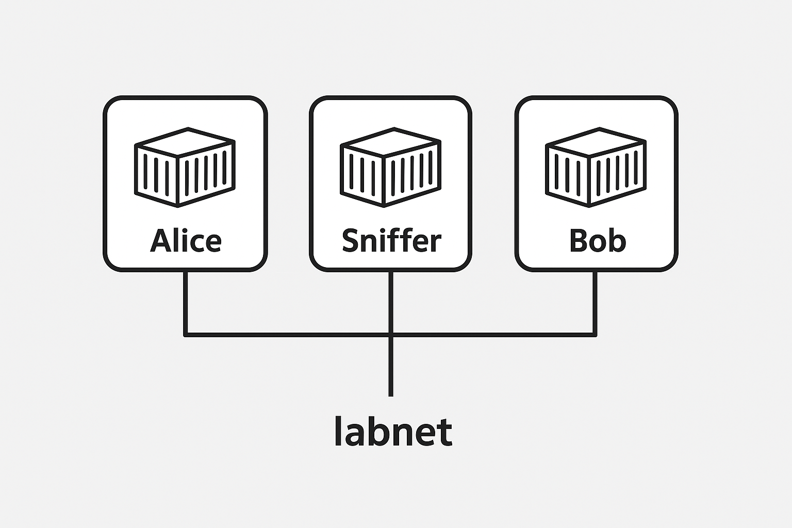

# Laboratório de tcpdump

## Alice e Bob (com Sniffer)



## ICMP

1. Levante os containers (Alice, Bob e Sniffer)
    ```bash
    make up
    ```
    Esse comando é equivalente a:
    ```bash
    docker compose up -d
    ```

    Verifique se os containers estão realmente rodando n Codespace:
    ```bash
    docker ps -a
    ```
    Resultado esperado:
    ```bash
    CONTAINER ID   IMAGE             COMMAND                  CREATED          STATUS          PORTS     NAMES
    e798c4c87ef9   tcpdump-alice     "sh -c 'sleep infini…"   11 minutes ago   Up 11 minutes             alice
    4c4b95bb5ac0   tcpdump-sniffer   "tail -f /dev/null"      11 minutes ago   Up 11 minutes             sniffer
    46df9eda7708   tcpdump-bob       "sh -c 'sleep infini…"   11 minutes ago   Up 11 minutes             bob
    ```

1. Entre no container Alice
    ```bash
    make Alice
    ```
    ou
    ```bash
    docker exec -it alice sh
    ```

1. Entre no container Sniffer
    ```bash
    make Sniffer
    ```

1. No Sniffer, ative o sniffer
    ```bash
    tcpdump -i any icmp
    ```

1. Em Alice, ping Bob
    ```bash
    ping bob
    ```

1. Analise os pacotes que estão trafegando:
    - Que protocolo aparece?
    - Qual o endereço IP de origem e destino?
    - Qual a diferença entre echo request e echo reply?

---

## HTTP/HTTPS

1. Levante os três containers

1. No Sniffer:
    ```bash
    tcpdump -i any -n 'tcp port 80 and host 172.28.0.2'  -A
    ```

    A opção `-A` exibe o resultado em ASCII. Para exibir em hexadecimal com ASCII, usar a opção `-XX`

1. Em Alice (ou Bob):
    ```bash
    curl http://example.com
    ```
    Ou
    ```bash
    wget http://example.com
    ```

1. Tente novamente com **HTTPS**:

    Em Sniffer:
    ```bash
    tcpdump -i any -n 'tcp port 443 and host 172.28.0.2' -A
    ```

    Em Alice:
    ```bash
    curl https://example.com
    ```
